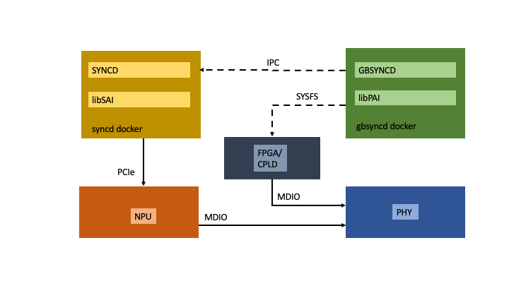
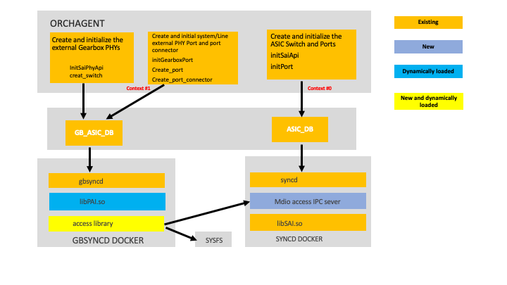

# Sonic gbsyncd/PAI mdio access HLD

#### Rev 0.1

## Table of Content 
  * [List of Tables](#list-of-tables)
  * [Revision](#revision)
  * [Scope](#scope)
  * [Definition/Abbreviation](#definition_abbreviation)
  * [Document/References](#document_references)
  * [Overview](#overview)
  * [Requirements](#requirements)
  * [Architecture Design](#architecture-design)
  * [High-Level Design](#High-Level-Design)
  * [SAI API](#SAI-API)
  * [Configuration and management](#Configuration-and-management)
  * [Restrictions/Limitations](#Restrictions_Limitations)

## List of Tables
- [Table 1: Abbreviations](#table-1-abbreviations)
- [Table 2: References](#table-2-references)

### Revision
| Rev  |    Date    |       Author      | Change Description                              |
|:----:|:----------:|:-----------------:|:-----------------------------------------------:|
| 0.1  | 07/31/2022 |   Jiahua Wang     | Initial version                                 |

### About this Manual

This document provides general information about gearbox MDIO functionality and implementation in utilizing the PAI library and gbsyncd for SONiC. This document also provides a design to build a single gbsyncd docker to work with various PAI library and different external PHY access method. 

### Scope
This document describes the high level design of the gbsyncd mdio access function with the focus on using the mdio bus from the switch NPU. This function primarily consists of two new syncd classes, one new mdio access library, addition of SAI switch api and changes in switch NPU configuration. The function helps the gbsyncd and PAI library to access the mdio devices (External PHYs). One of the new syncd class also helps to dynamically load PAI library and MDIO access library at runtime so that only a single gbsyncd docker can work for different switch platforms with external PHY.

### Definitions/Abbreviations 

#### Table 1 Abbreviations

| **Term**         | **Meaning**                                                                |
|------------------|----------------------------------------------------------------------------|
| gbsyncd          | The daemon and docker servicing external PHY configuration processing      |
| IPC              | Inter-Process-Communication                                                |
| MDIO             | Management Data Input/Output used to access the registers of external PHY  |
| MDIO Clause 22   | Defined in Clause 22 of IEEE RFC802.3 to access 32 registers on 32 ports   |
| MDIO Clause 45   | Defined in Clause 45 of the 802.3ae to access 65,536 registers in 32  devices on 32 ports |
| PAI              | Switch Abstraction Interface used for external PHY programming             |
| PHY              | Physical Layer chip devices (commonly found on Ethernet devices)           |
| SAI              | Switch Abstraction Interface                                               |

### Document/References

#### Table 2 References

| **Document**                       | **Location**  |
|------------------------------------|---------------|
| Add switch api for clause 22 mdio access | [https://github.com/opencomputeproject/SAI/pull/1507](https://github.com/opencomputeproject/SAI/pull/1507) |
| Add sai\_mdio\_access\_clause22=1 in td3x2-a720dt-48s-flex.config.bcm | [https://github.com/Azure/sonic-buildimage/pull/11303](https://github.com/Azure/sonic-buildimage/pull/11303) |
| Add support of mdio IPC server class using sai switch api and unix socket | [https://github.com/sonic-net/sonic-sairedis/pull/1080](https://github.com/sonic-net/sonic-sairedis/pull/1080) |
| Add mdio IPC client library | [https://github.com/Azure/sonic-buildimage/pull/11280](https://github.com/Azure/sonic-buildimage/pull/112804) |

### Overview 

The Ethernet switches of today often have PHY, re-timer and mux. Some PHY is internal to the switch NPU, but most PHY is external to the switch NPU. From software point of view, PHY is considered as internal when the PHY is supported by the SAI or SDK of the switch NPU. External PHY does not have support by the switch NPU SAI/SDK. External PHY requires PAI support. In SONiC gearbox framework, there is a gbsyncd docker and daemon servicing the externl PHY configuration processing.

### Requirements

The syncd docker and daemon use the SAI library to service the NPU programming. The SAI library uses PCIe to access the NPU hardware. The gbsyncd docker and daemon use the PAI library to service the external PHY configuration processing. The PAI library usualy uses MDIO to access the PHY hardware.

It depends on the switch hardware design that the external PHY could be connected to a FPGA or CPLD based MDIO controller or a switch NPU MDIO bus. The FPGA or CPLD based MDIO controller often has linux kernel driver and provides linux sysfs programming interface. The switch NPU MDIO bus uses SAI library hence an Inter-Process-Communication (IPC) mechanism is required between the syncd daemon and gbsyncd daemon.

There are 2 mdio access modes: clause 45 and clause 22. Some external PHY uses clause 45 mdio while other external PHY uses clause 22 mdio. The switch NPU sai switch api should distinguish the 2 modes.

When a configured platform target is built, there is only one syncd docker as the SAI library for the configured platform will cover all the device with switch NPU in the same configured platform class. Although the gbsyncd docker is very much similar to the syncd docker, there could be many gbsyncd docker required as there are different PAI library for different PHY and MDIO access method. Our goal is to build a single gbsyncd docker to cover all PHY and MDIO access method.

### Architecture Design 

There are many choices for the IPC mechanism between the syncd daemon and gbsyncd daemon. One performance requirement is that it should finsh firmware download within a reasonable time. Our design choice is to use the Unix socket as the IPC mechanism. Our design has the MDIO IPC server in the syncd daemon with its own thread. A new syncd class MdioIpcServer is added to start a new thread, to create an unix socket, to listen on the socket, to accept connection and to read/reply IPC messages.

There is a corresponding MDIO access IPC client code in the form of dynamic link library which provides the flexiblity to load the library at runtime. Assuming the MDIO access library for sysfs is also in the form of dynamic library, gbsyncd can select the MDIO access library at runtime based on some configuration in the gearbox\_config.json file.

The same gearbox\_config.json file already has the information of the PAI library name. The information can be used to dynamically load the PAI library at runtime.

The informationn of PHY device using clause 22 mdio can also be added to the gearbox\_config.json file. It will help to decide the mdio access mode at runtime.

A new syncd class called VendoPaiDLL is created to handle the dynamic loading of the libraries. The VendorPaiDLL is very similar to the syncd class VendorSai. The VendorSai class handles the SAI library. The VendorPaiDLL will handle the PAI library and MDIO access library.

### High-Level Design 

The high level design of the gbsyncd mdio access function using the mdio bus from the switch NPU and using single gbsyncd docker in SONiC image can be covered in the following points:
		
	- It is an enhancement to the sonic gearbox framework.
	- Syncd, SAI and some sonic device files are modified.
	- There are 3 repositories that would be changed, sonic-sairedis, SAI and sonic-buildimage.
	- gbsyncd will have dependencies on syncd to create the Unix IPC socket. 
	- Syncd will have 2 new classes, one for the MDIO IPC server, another one for loading the PAI library and MDIO access library.
	- External PHY firmware download time always has performance requirements/impact.
	- For debugging, beside the syslog logging, the Unix socket IPC mechanism can be simulated by socat.
	- The current change is only limited to the Broadcom switch NPU platform.
	- SAI switch api has added the mido clause 22 access functions.
	- The SaiInterface class has added the mdio clause 45 read/write and mdio clause 22 read/write virtual functions.
	- The derived class VendoPai also has overridden the mdio clause 45 read/write and mdio clause 22 read/write virtual functions.
	- 2 keys are added to the gearbox configuration file "gearbox\_config.json".

The VendorPaiDll class is used in syncd.cpp. We assume the context number is the same as the PHY id.

	int syncd_main(int argc, char **argv)
	{
	    ...
	    if (commandLineOptions->m_globalContext != 0) {   
	        auto vendorSai = std::make_shared<VendorPaiDLL>((int)commandLineOptions->m_globalContext);
	        ...
	    } else {   
	        auto vendorSai = std::make_shared<VendorSai>();
	        ...
	    }
	    ...
	}

The VendorPaiDLL class is implemented in VendorPaiDLL.cpp. The functions gbsyncd\_get\_pai\_lib\_name(), gbsyncd\_get\_phy\_access\_lib\_name() and gbsyncd\_get\_mdio\_cl22\_only() will get the JSON key values for "lib\_name", "phy\_access\_lib\_name" and "mdio\_cl22\_only" in the configuration file "gearbox\_config.json".

	VendorPaiDLL::VendorPaiDLL(int phy_id)
	{
	    ...
	    m_sai_dll_handle = dlopen (gbsyncd_get_pai_lib_name().c_str(), RTLD_LAZY);
	    *(void**)(&dll_sai_api_initialize) = dlsym(m_sai_dll_handle, "sai_api_initialize");
	    *(void**)(&dll_sai_api_uninitialize) = dlsym(m_sai_dll_handle, "sai_api_uninitialize");
	    *(void**)(&dll_sai_api_query) = dlsym(m_sai_dll_handle, "sai_api_query");
	    ...
	    m_access_lib_handle = dlopen (gbsyncd_get_phy_access_lib_name().c_str(), RTLD_LAZY);
	    m_mdio_cl22_only = gbsyncd_get_mdio_cl22_only();
	    ...
	    if (m_mdio_cl22_only)
	    {   
	        *(void**)(&m_mdio_read) = dlsym(m_access_lib_handle, "mdio_read_cl22");
	    } else {
	        *(void**)(&m_mdio_read) = dlsym(m_access_lib_handle, "mdio_read");
	    }
	    ...
	    if (m_mdio_cl22_only)
	    {   
	        *(void**)(&m_mdio_write) = dlsym(m_access_lib_handle, "mdio_write_cl22");
	    } else {
	        *(void**)(&m_mdio_write) = dlsym(m_access_lib_handle, "mdio_write");
	    }   
	    ...
	}
	...
	sai_status_t VendorPaiDLL::create(
        _In_ sai_object_type_t objectType,
        _Out_ sai_object_id_t* objectId,
        _In_ sai_object_id_t switchId,
        _In_ uint32_t attr_count,
        _In_ const sai_attribute_t *attr_list)
	{
	...
		if (objectType == SAI_OBJECT_TYPE_SWITCH)
		{
		    std::vector<sai_attribute_t> attr_copy;
		    sai_attribute_t attr;
		    
		    for (auto i = 0; i < attr_count; i++)
		    {
		        if (attr_list[i].id == SAI_SWITCH_ATTR_REGISTER_READ)
		        {
		        attr.id = SAI_SWITCH_ATTR_REGISTER_READ;
		        attr.value.ptr =  (void *) m_mdio_read;
		        attr_copy.push_back(attr);
		        }
		        else if (attr_list[i].id == SAI_SWITCH_ATTR_REGISTER_WRITE)
		        {
		        attr.id = SAI_SWITCH_ATTR_REGISTER_WRITE;
		        attr.value.ptr =  (void *) m_mdio_write ;
		        attr_copy.push_back(attr);
		        }
		        else
		        {
		        attr_copy.push_back(attr_list[i]);
		        }
		    }
		    sai_attribute_t *attr_array = attr_copy.data();
		    auto status = info->create(&mk, switchId, attr_count, attr_array);
		    ...
		}
		else
		{
		    auto status = info->create(&mk, switchId, attr_count, attr_list);
		    ...
		}
	...
	}

### SAI API 

When a switch platform with external PHY is connected to the MDIO bus from the switch NPU, the external PHY is accessed through the SAI and syncd. The existing SAI switch api already has mdio access functions switch\_mdio\_read and switch\_mdio\_write defined, but it does not distinguish the Clause 45 mdio from the Clause 22 mdio. New mdio access functions switch\_mdio\_cl22\_read and switch\_mdio\_cl22\_write are added to the SAI switch api to handle the Clause 22 mdio only.

	typedef struct _sai_switch_api_t
	{
	    sai_create_switch_fn                   create_switch;
	    sai_remove_switch_fn                   remove_switch;
		...
	    sai_switch_mdio_read_fn                switch_mdio_read;
	    sai_switch_mdio_write_fn               switch_mdio_write;
		...
	+   sai_switch_mdio_cl22_read_fn           switch_mdio_cl22_read;
	+   sai_switch_mdio_cl22_write_fn          switch_mdio_cl22_write;
	} sai_switch_api_t;

For backward compatibility of the SAI API before above change, the Clause 22 mdio device can still be accessed using the existing mdio access functions together with extra configuration in NPU SAI/SDK or experimental switch attribute. For example, new SAI soc property is added to the config.bcm file for a switch platform with external PHY using the Clause 22 mdio registers:

	device/arista/x86_64-arista_720dt_48s/td3x2-a720dt-48s-flex.config.bcm:
	...
	+sai_mdio_access_clause22=1

### Configuration and management 
Each device with external PHY should have a configuration file gearbox_config.json. One JSON key "lib\_name" has the value of the PAI library name. We add 2 more JSON keys. One new JSON key "phy\_access\_lib\_name" has the value of the mdio access library name. The other new JSON key "mdio\_cl22\_only" indicates the PHY device using clause 22 mdio.

gearbox_config.json:

	"phys": [
	{   
	  "phy_id": 1,
	  ...
	  "lib_name": "/usr/lib/libpai_layer.so",
	  ...
	  "phy_access": "mdio",
	+ "phy_access_lib_name": "/usr/lib/libgbsyncdaccess.so",
	+ "mdio_cl22_only": true,
	  ...
	}   
	],  

### Restrictions/Limitations  
When the external PHY is connected to the MDIO bus from the switch NPU, this design only applies to the device with Broadcom SAI/NPU. When external PHY is connected to the FPGA/CPLD based mdio controller, this design should work for all device.

When external PHY is using broadcast firmware download method, there might be requirements of other software components and helper depends on the PAI library implementation. It is outside the scope of this HLD.